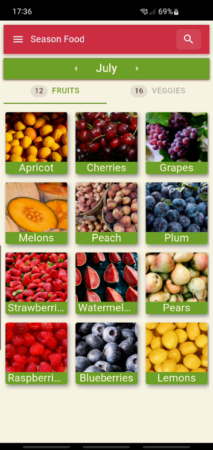

## About the app

This project was developed to address a genuine challenge: determining the availability of fruits and vegetables in a new country or region. Despite searching for solutions and information, we couldn't find anything intuitive or capable of meeting my needs.

The concept behind this project was to create a simple and scalable solution, making it easy to modify and expand the database for different countries or regions. The primary objective of this app is to promote the consumption of locally grown produce, empower small-scale farmers, and ultimately reduce our contribution to global warming.

The project is written in React/Typescript, using [MUI](https://mui.com/) library for the UI. The Android app is built using [Capacitor](https://capacitorjs.com/).

## First Release (Summer 2025)
This first release has dat for **Italy only** 🇮🇹. Also in this initial release we have a web version and an Android app, available in English,Italian and Brazilian Portuguese. 

## Roadmap - upcoming features

* 🌎 Add more countries: we will make it possible to select which country do you want to see the fruits and vegetables in season.
* 📌 Add more local data: we are looking for more local datasets, to make it possible to search for even more local fruits and vegetables in season. Think about searching for seasonal food in South France or in a province, like Liguria in Italy.
* 📊 Create new ways of visualizing the food in season information, with full year diagrams.
* 🍇 🍉 🍑 🥝 🍒 Make it possible to select a group of fruits and vegetables and see all of them in a calendar.
* 🔍 Add synonyms or variant names. Some fruits and vegetables have more than one name, depending of the country's region.
* 🛢Create a public dataset with all the information that we are gathering.


### Data sources

Source of data for fruits and vegetables from [Slow Food Italy](https://www.slowfood.it/guide-al-consumo/) [Compsumption Guide](https://www.slowfood.it/wp-content/uploads/blu_facebook_uploads/2014/09/ita_guida_consumo_b.pdf)

<!-- Source for mushrooms from [Greenme](https://www.greenme.it/salute-e-alimentazione/mangiare-sostenibile/funghi-stagionalita/) -->



# How to use

There is a online web version [here](https://seasonalfood.raposinha.dev/month/1). The homepage already shows you the current month and fruits and vegetables of the season in Italy. You can also download a mobile app in F-Droid or Google Play, and soon it will also be available in Apple store.

## Contribute

This project is built with modern web technologies and cross-platform mobile development tools. Here's how to get started:

### Prerequisites

- **Node.js** (v16 or higher)
- **npm** or **yarn** package manager
- For Android development: **Android SDK** and **Android Studio**

### Tech Stack

- **Frontend**: React 18 with TypeScript
- **Build Tool**: Vite 4
- **UI Library**: Material-UI (MUI) v5
- **Mobile App**: Capacitor 7 for cross-platform deployment
- **Internationalization**: i18next with multi-language support (EN, IT, PT)
- **Search**: Fuse.js for fuzzy search functionality
- **Data Processing**: Papa Parse for CSV handling

### Development Setup

1. **Install dependencies:**
   ```bash
   npm install
   # or
   yarn install
   ```

2. **Start development server:**
   ```bash
   npm run dev
   ```

3. **Build for production:**
   ```bash
   npm run build
   ```

4. **Lint code:**
   ```bash
   npm run lint
   ```

### Building the Android App

1. **Build app bundle:**
   ```bash
   npm run build-app
   ```

2. **Open in Android Studio:**
   ```bash
   ANDROID_SDK=/path/to/android-sdk CAPACITOR_ANDROID_STUDIO_PATH=/path/to/android-studio/bin/studio.sh npm run run-app-android
   ```

### Project Structure

- `src/` - Main React/TypeScript source code
- `public/` - Static assets and CSV data files
- `android/` - Capacitor Android project files
- `components/` - Reusable React components
- `contexts/` - React context providers
- `routes/` - Application routing components
